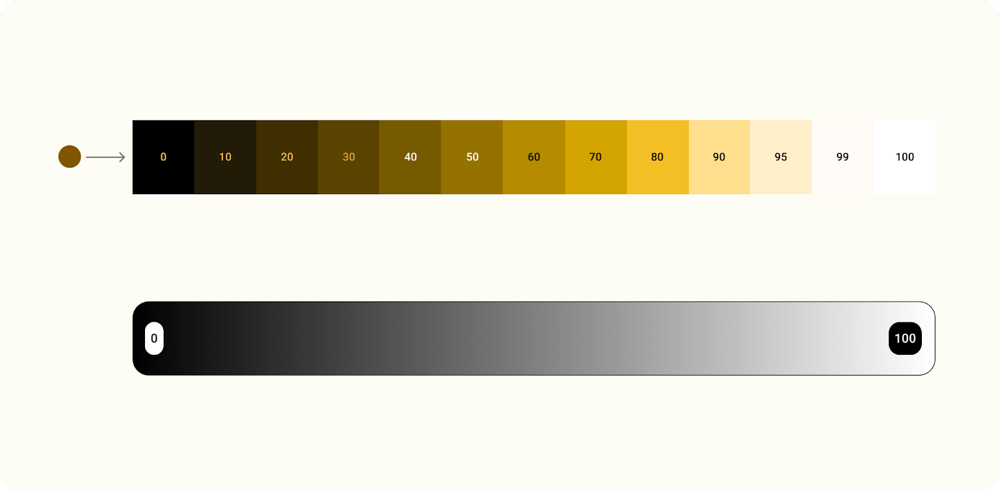

# What is Dynamic color?

Material You reimagines color as a more individualized experience. Through dynamic color extraction, the range of possible color experiences is significantly broader.

Dynamic color is a key part of Material You in which an algorithm derives custom colors from a user's wallpaper to be applied to their apps and system UI.

## Luminance

Dynamic color is built to work across unpredictable contexts. To manage contrast ratios in various viewing contexts, luminance levels are the key attribute that allow colors to combine successfully even without the product team testing each specific color combination.

Elements with similar luminance will not have appropriate contrast for legibility, while elements with different luminance values will be more distinguishable.

> [!IMPORTANT]
> **Luminance** or tone describes the level of light that a digital color value represents.

## Tonal palette

A tonal palette is a translation of one hue (a dynamic extracted color) into a spectrum of related tones. The translation of a color into thirteen tones enables a group of tonal ranges, called a tonal palette, to be applied in different contexts, from individual elements inside a component to entire app themes.

> [!IMPORTANT]
> Key Takeaways
> 
> * Designing with luminance crates more accessible color palettes.
> * Extracted source color becomes 5 tonal palettes.